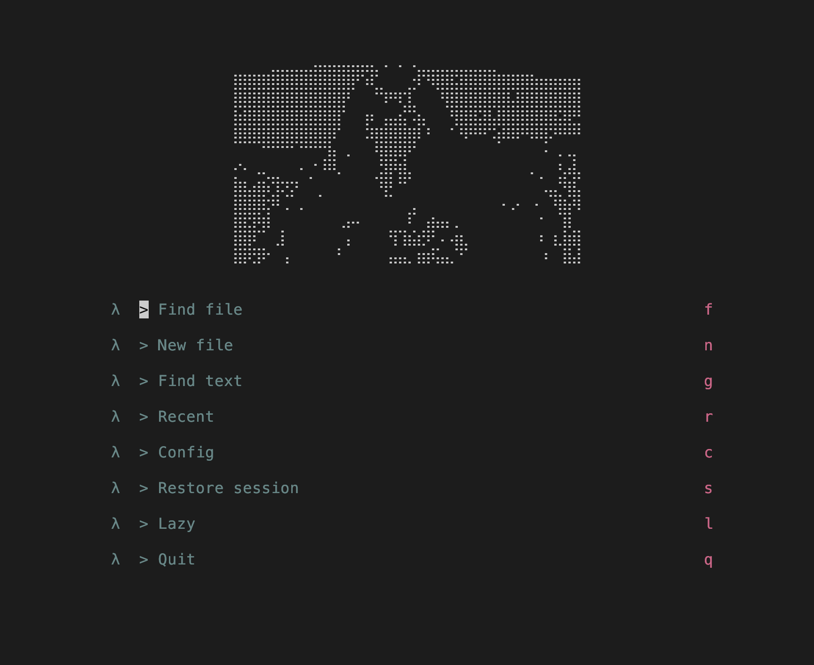
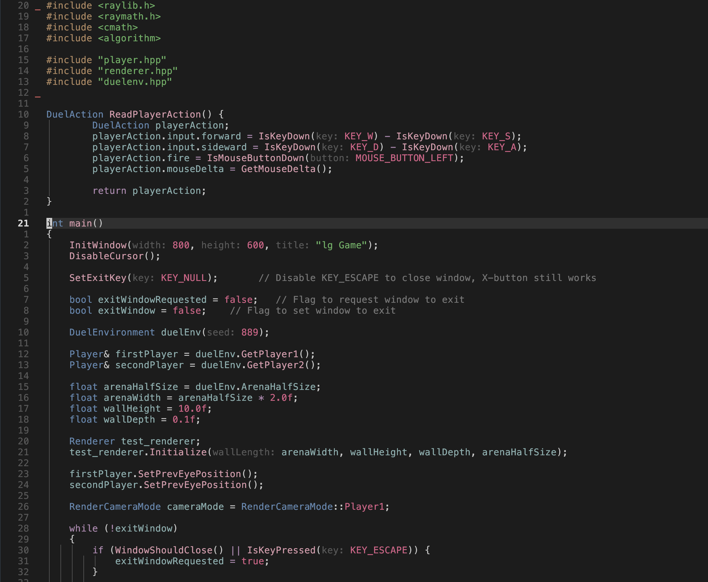

# dotfiles

## visuals 




## gnu stow
Use [GNU Stow](https://www.gnu.org/software/stow/manual/stow.html) for symlinks
```bash
stow -d ~/dotfiles/shared -t ~ nvim
```
So it works by calling
```bash
stow -d x1:shared -t x:2~ x:3nvim
```
pwd = ~/dotfiles\
x1  = shared \
x2 = ~\
x3  = nvim\
pwd + x1 + x3 = ~/dotfiles/shared/nvim\
so it is like:\
source=pwd/x1/x3/relative path\
target=x2/relative path\
